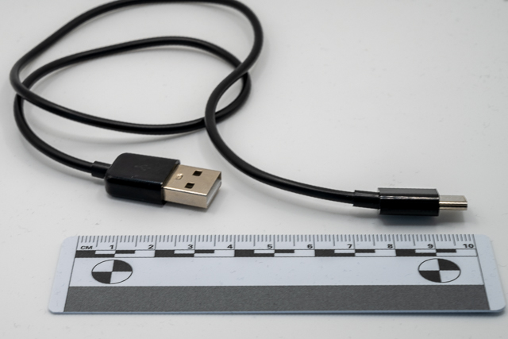

# Investigation summary



## Introduction

I purchased this device from [zSecurity](https://zsecurity.org/product/badusb-c-keystroke-injection-cable/). It appears to be based on a ATTiny85 device. 

### Pros and Cons

| Pros                           | Cons                                               |
| :----------------------------- | :------------------------------------------------- |
| Looks like a cheap USB-C cable | Does pop up dialog in Windows 10 installing device |
| Good list of examples          |                                                    |

### Uses

* Keystroke Injection Attack (BadUSB)

## Issues

* The Arduino package from zSecurity will confict with the Digispark one for the same device.

## Detailed investigation

### Creating an attack

1. Goto File > Preferences
2. Add `https://raw.githubusercontent.com/zSecurity-org/BadUSBArduino/refs/heads/main/package_badusbarduino_index.json` to the Additional Boards Managers URLs save
3. Goto board manager
4. Install `BadUSB Cable` by zSecurity v1.7.2
5. Select BadUSB Cable device
6. Select `micronecleus.2.5` as the programmer

As the cable is based on an attiny85 digispark I used the following attack.

```C
#include <DigiKeyboard.h>

/* Init function */
void setup()
{
  DigiKeyboard.delay(3000);
  DigiKeyboard.println("Hello, World!");
  DigiKeyboard.sendKeyStroke(KEY_ENTER); 
}

/* Unused endless loop */
void loop() {}
```

### Operation

1. Check device is in attack mode
2. Insert into USB port

### Setup

### Registry information

Detection under windows:

#### Device 1

##### Registry Entries for Device 1

| VendorId | ProductId | Interface | Description         | Notes                        | Keys                                                                       |
| -------- | --------- | --------- | ------------------- | ---------------------------- | -------------------------------------------------------------------------- |
| 0x16C0   | 0x27DB    |           | USB Input Device    | ParentIdPrefix: 6&38bdc472&0 | HKLM\System\CurrentControlSet\Enum\USB\VID_16C0&PID_27DB\5&1d69338f&0&1    |
| 0x16C0   | 0x27DB    |           | HID Keyboard Device |                              | HKLM\System\CurrentControlSet\Enum\HID\VID_16C0&PID_27DB\6&38bdc472&0&0000 |
| 0x16D0   | 0x0753    |           |                     |                              | HKLM\System\CurrentControlSet\Enum\USB\VID_16D0&PID_0753\5&1d69338f&0&1    |

## Device Findings

The device following device:

| Vendor id | Product Id | Information                                       |
| --------- | ---------- | ------------------------------------------------- |
| 0x16D0    | 0x0753     | Digistump DigiSpark (Pid sold by MCS Electronics) |
| 0x16C0    | 0x27DB     | Van Ooijen Technische Informatica Keyboard        |

The findings for this device match the [Digispark V3](../Digispark//Summary.md).

These devices are not traceable across a network as they have windows generated ids.
