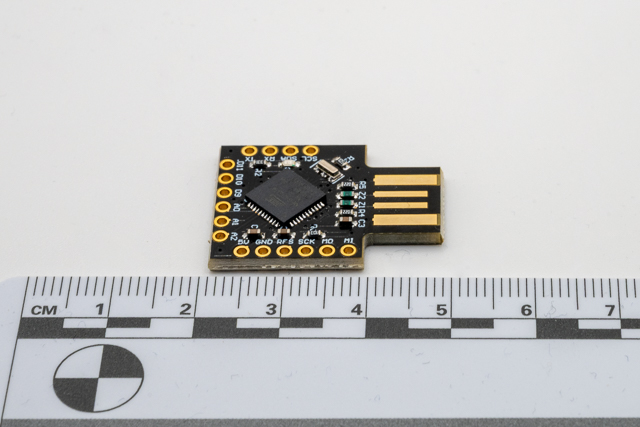
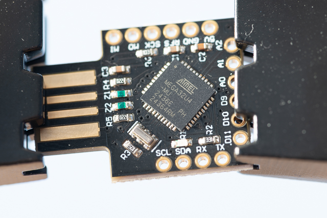

# Investigation summary



## Introduction

Devices puchased from [Amazon](https://www.amazon.co.uk/dp/B07VL6G914).

This is a low cost Bad USB device, based on a [Leonardo Arduino](https://docs.arduino.cc/hardware/leonardo/).

* There are some GitHub projects to help [jimididit](https://github.com/jimididit/badusb-beetle)
* There is another project to convert Ducky Script to arduino code.
  * [Duckuino](https://d4n5h.github.io/Duckuino/).
  * [Duckuino Site](https://dukweeno.github.io/Duckuino/), [Github](https://github.com/Dukweeno/Duckuino)

This device does not appear as a USB drive.

### Pros and Cons

| Pros                  | Cons                  |
| :-------------------- | :-------------------- |
| Cheap (~£11)          | No Instructions       |
| Looks like a USB disk | Programmed in C / C++ |

#### There are 3D printable cases available

* [Thingverse - CJMCU Beetle Case](https://www.thingiverse.com/thing:2367745)

### Uses

* Keystroke Injection Attack (BadUSB)

## Issues

No SD Card storage, so all attacks are stored internally, programmed directly in C++ via Arduino

## Detailed investigation

### Creating an attack

I copied the Hello world [DuckyScript](https://docs.hak5.org/hak5-usb-rubber-ducky/duckyscript-tm-quick-reference) attack written for the CJMCU. I generated the following script using the [Duckuino](https://dukweeno.github.io/Duckuino/) site.

```C
/**
 * Made with Duckuino, an open-source project.
 * Check the license at 'https://github.com/Dukweeno/Duckuino/blob/master/LICENSE'
 */

#include "Keyboard.h"

void typeKey(uint8_t key)
{
  Keyboard.press(key);
  delay(50);
  Keyboard.release(key);
}

/* Init function */
void setup()
{
  // Begining the Keyboard stream
  Keyboard.begin();

  // Wait 500ms
  delay(500);

  delay(3000);
  Keyboard.print(F("Hello, World!"));

  typeKey(KEY_RETURN);

  // Ending stream
  Keyboard.end();
}

/* Unused endless loop */
void loop() {}
```

I then progremmed this into each device using the [Arduino IDE](https://www.arduino.cc/en/software/), using the Arduino Leonardo setting for the detected device.

### Operation

To run the attack, insert the USB drive

### Setup

I restarted the test PC to a known image between insertions. Registry changes generated by [NirSoft RegistryChanges](https://www.nirsoft.net/utils/registry_changes_view.html)

### Registry information

Dictection under windows:

This is a Arduino Leonardo under the hood so we should expect

| VendorId | ProductId |
| -------- | --------- |
| 0x2341   | 0x8036    |

#### Device 1

##### Registry Entries for Device 1



| Vendor id | Product Id | Interface | Description                 | Notes                           | Keys                                                                                       |
| --------- | ---------- | --------- | --------------------------- | ------------------------------- | ------------------------------------------------------------------------------------------ |
| 0x2341    | 0x8036     |           | RootDevice                  | "ParentIdPrefix"="6&1b780c72&0" | HKEY_LOCAL_MACHINE\System\ControlSet001\Enum\USB\VID_2341&PID_8036\HIDPC                   |
| 0x2341    | 0x8036     | 0x00      | USB Serial                  | USB serial COM Port             | HKEY_LOCAL_MACHINE\System\ControlSet001\Enum\USB\VID_2341&PID_8036&MI_00\6&1b780c72&0&0000 |
| 0x2341    | 0x8036     | 0x01      | Does Not appear in registry |                                 |                                                                                            |
| 0x2341    | 0x8036     | 0x02      | Human Interface Device      | "ParentIdPrefix"="7&155d1953&0" | HKEY_LOCAL_MACHINE\System\ControlSet001\Enum\USB\VID_2341&PID_8036&MI_02\6&1b780c72&0&0002 |
| 0x2341    | 0x8036     | 0x02      | Human Interface Device      | HID Keyboard Device             | HKEY_LOCAL_MACHINE\System\ControlSet001\Enum\HID\VID_2341&PID_8036&MI_02\7&155d1953&0&0000 |

#### Notes

There is one device id used (HIDPC). The device is not uniquely identifiable on a single PC nor across systems.
