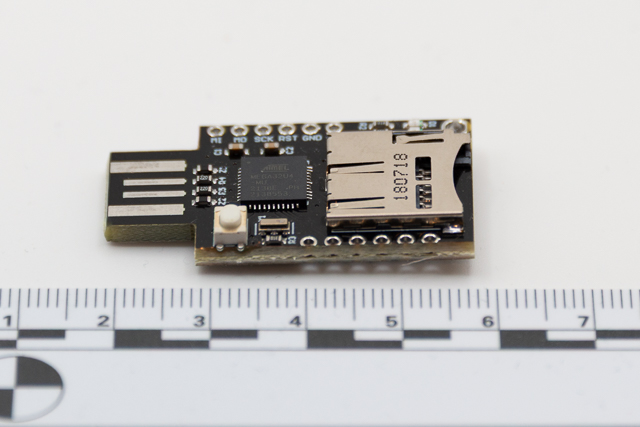
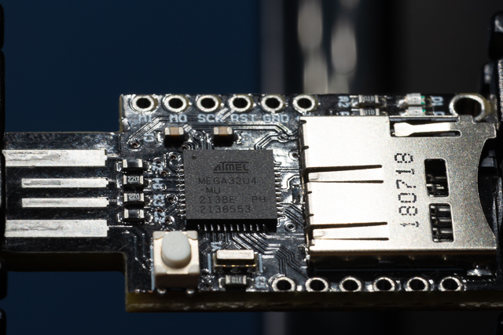
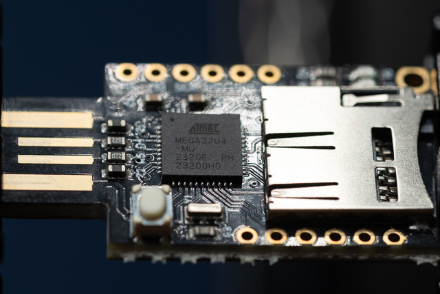
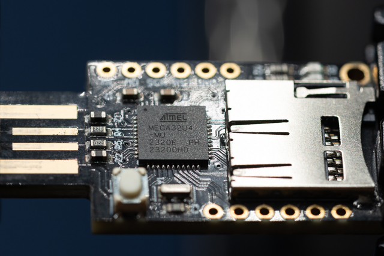
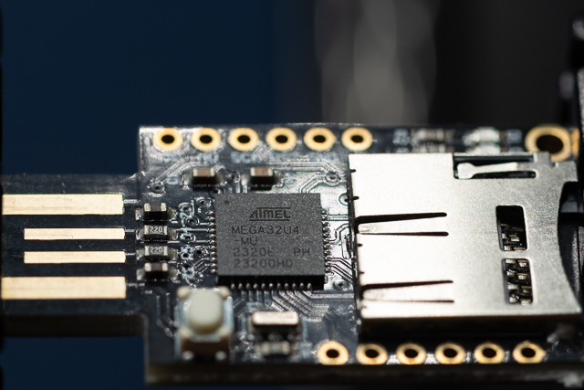

# Investigation summary



## Introduction

This is a low cost circuit board only Bad USB device. It is based on a [Leonardo Arduino](https://docs.arduino.cc/hardware/leonardo/) combined with a MicroSd card reader. An example info on how to set it up as a ["RubberDucky"](https://shop.hak5.org/products/usb-rubber-ducky) clone can be found [here](https://github.com/asciiterminal/CJMCU_ATMEGA32U4_BADUSB), or [here](https://github.com/Seytonic/Duckduino-microSD).This uses the Arduino IDE to flash the Atmel Atmega32U4 to read code from the SD and then execute.

This device does not appear as a USB drive, unlike the [Hackipy](../hackypi/Summary.md) which means that it is less likely to be blocked.

### Pros and Cons

| Pros                                                     | Cons                                                          |
| :------------------------------------------------------- | :------------------------------------------------------------ |
| Cheap (~£15)                                             | Obviously not a normal USB                                    |
| Good training device for switching to a RuberDucky later | Limited to Keystroke Injection Attack (subset of Duckyscript) |
|                                                          | No Case                                                       |
|                                                          | No instructions                                               |
|                                                          | May require external programmer                               |

#### There are 3D printable cases available

* [Thingverse - CJMCU BADUSB case](https://www.thingiverse.com/thing:2879549)
* [Thingverse - Bad usb CJMCU case](https://www.thingiverse.com/thing:6254638)  
  
### Uses

* Keystroke Injection Attack (BadUSB)

## Issues

* This only supports FAT32 cards
* Frequently these devices can not be programmed via thier USB connector and will require a SPI connection. The 6 pins at the top left of the image above are a SPI connection.

## Detailed investigation

### Creating an attack

This was relatively simple once I had a look at the Arduino sketch.

1. I formatted the SD card to FAT32 (32gb microSD).
2. Create a hello world [DuckyScript](https://docs.hak5.org/hak5-usb-rubber-ducky/duckyscript-tm-quick-reference)

```DuckyScript
  DELAY 3000
  STRING Hello, World!
  ENTER
 ```

3. Save the script as `script.txt`onto the microSD card.

### Setup

I ordered 4 of these devices. I was able to program a single device via its USB connector using the Arduino UI, I suspect more by fluke than intention. I then noticed that the 6 top pins match a 6 pin SPI (Serial Preripheral Interface) ISP (In-System Programmer).

I connected the [6 pin Clips](https://www.amazon.co.uk/dp/B0DXFC9B2H) to the board and wired it to the [USBasp Programmer with ISP Adapter](https://www.amazon.co.uk/dp/B07Y3B8H91)'s SPI board using the [Dupont Wires](https://www.amazon.co.uk/dp/B01EV70C78).

| Pin name on USBasp | Pin on Board | Full name                   |
| ------------------ | ------------ | --------------------------- |
| VCC                | +5V          | Voltage at Common Collector |
| MOSI               | MO           | Master Out Slave In         |
| GND                | GND          | Ground                      |
| RST                | RST          | Reset                       |
| SCK                | SCK          | Serial Clock                |
| MISO               | MI           | Master In Slave Out         |

I then connected the [USBasp Programmer with ISP Adapter](https://www.amazon.co.uk/dp/B07Y3B8H91) and use [zadig](https://zadig.akeo.ie/) to connect it to the [libusbK](https://libusbk.sourceforge.net/UsbK3/) driver in Windows 10, which is needed by the [Arduino IDE](https://www.arduino.cc/en/software/).

I selected the board type (Leonardo) and the programmer (USBasp)

I was then able to flash the Atemga processors from the IDE with the Upload via programmer option.

All devices were successfully flashed with [Seytonics Duckduino sketch](https://github.com/Seytonic/Duckduino-microSD/blob/master/Duckduino-microSD/Duckduino-microSD.ino), copied [locally](./Duckduino-microSD/Duckduino-microSD.ino).

Test machine was restored to base image between insertions using [RebootRestore RX](https://horizondatasys.com/reboot-restore-standard/)

### Registry information from creation

Detection under windows:

Given this device is cloning a Arduino Leonard we would expect to see the following

Values taken from [DeviceHunt](https://devicehunt.com/view/type/usb/vendor/2341#search-results-table)

| Vendor id | Product Id | Description                     |
| --------- | ---------- | ------------------------------- |
| 0x2341    | 0x0036     | Arduino Leonardo BootLoader     |
| 0x2341    | 0x8036     | Arduino Leonardo (CDC ACM, HID) |
|           |            |                                 |

#### Device 1

[Amazon](https://www.amazon.co.uk/dp/B09QGZ31M4)



This was the only device that I could flash via the USB connector

##### Registry Entries for Device 1

| Vendor id | Product Id | Interface | Description            | Notes                           | Keys                                                                                       |
| --------- | ---------- | --------- | ---------------------- | ------------------------------- | ------------------------------------------------------------------------------------------ |
| 0x2341    | 0x0036     |           | Bootloader Root Device | USB Serial Device               | HKEY_LOCAL_MACHINE\System\ControlSet001\Enum\USB\VID_2341&PID_0036\5&1d69338f&0&1          |
|           |            |           |                        |                                 |                                                                                            |
| 0x2341    | 0x8036     |           | Root Device            | "ParentIdPrefix"="6&1b780c72&0" | HKEY_LOCAL_MACHINE\System\ControlSet001\Enum\USB\VID_2341&PID_8036\HIDPC                   |
| 0x2341    | 0x8036     | 0x00      | USB Serial             | USB serial COM Port             | HKEY_LOCAL_MACHINE\System\ControlSet001\Enum\USB\VID_2341&PID_8036&MI_00\6&1b780c72&0&0000 |
| 0x2341    | 0x8036     | 0x01      |                        | Does Not appear in registry     |                                                                                            |
| 0x2341    | 0x8036     | 0x02      | Human Interface Device | "ParentIdPrefix"="7&155d1953&0" | HKEY_LOCAL_MACHINE\System\ControlSet001\Enum\USB\VID_2341&PID_8036&MI_02\6&1b780c72&0&0002 |
| 0x2341    | 0x8036     | 0x02      | Human Interface Device | HID Keyboard Device             | HKEY_LOCAL_MACHINE\System\ControlSet001\Enum\HID\VID_2341&PID_8037&MI_02\7&8a23793&0&0000  |
|           |            |           |                        |                                 |                                                                                            |

#### Device 2

[Amazon](https://www.amazon.co.uk/dp/B0D8YB637T)



##### Registry Entries for Device 2

| Vendor id | Product Id | Interface | Description            | Notes                           | Keys                                                                                       |
| --------- | ---------- | --------- | ---------------------- | ------------------------------- | ------------------------------------------------------------------------------------------ |
| 0x2341    | 0x8036     |           | Root Device            | "ParentIdPrefix"="6&1b780c72&0" | HKEY_LOCAL_MACHINE\System\ControlSet001\Enum\USB\VID_2341&PID_8036\HIDPC                   |
| 0x2341    | 0x8036     | 0x00      | USB Serial             | USB serial COM Port             | HKEY_LOCAL_MACHINE\System\ControlSet001\Enum\USB\VID_2341&PID_8036&MI_00\6&1b780c72&0&0000 |
| 0x2341    | 0x8036     | 0x01      |                        | Does Not appear in registry     |                                                                                            |
| 0x2341    | 0x8036     | 0x02      | Human Interface Device | "ParentIdPrefix"="7&155d1953&0" | HKEY_LOCAL_MACHINE\System\ControlSet001\Enum\USB\VID_2341&PID_8036&MI_02\6&1b780c72&0&0002 |
| 0x2341    | 0x8036     | 0x02      | Human Interface Device | HID Keyboard Device             | HKEY_LOCAL_MACHINE\System\ControlSet001\Enum\HID\VID_2341&PID_8037&MI_02\7&8a23793&0&0000  |
|           |            |           |                        |                                 |                                                                                            |

#### Device 3

[Amazon](https://www.amazon.co.uk/dp/B0DSJK1K65)



##### Registry Entries for Device 3

| Vendor id | Product Id | Interface | Description            | Notes                           | Keys                                                                                       |
| --------- | ---------- | --------- | ---------------------- | ------------------------------- | ------------------------------------------------------------------------------------------ |
| 0x2341    | 0x8036     |           | Root Device            | "ParentIdPrefix"="6&1b780c72&0" | HKEY_LOCAL_MACHINE\System\ControlSet001\Enum\USB\VID_2341&PID_8036\HIDPC                   |
| 0x2341    | 0x8036     | 0x00      | USB Serial             | USB serial COM Port             | HKEY_LOCAL_MACHINE\System\ControlSet001\Enum\USB\VID_2341&PID_8036&MI_00\6&1b780c72&0&0000 |
| 0x2341    | 0x8036     | 0x01      |                        | Does Not appear in registry     |                                                                                            |
| 0x2341    | 0x8036     | 0x02      | Human Interface Device | "ParentIdPrefix"="7&155d1953&0" | HKEY_LOCAL_MACHINE\System\ControlSet001\Enum\USB\VID_2341&PID_8036&MI_02\6&1b780c72&0&0002 |
| 0x2341    | 0x8036     | 0x02      | Human Interface Device | HID Keyboard Device             | HKEY_LOCAL_MACHINE\System\ControlSet001\Enum\HID\VID_2341&PID_8037&MI_02\7&8a23793&0&0000  |
|           |            |           |                        |                                 |                                                                                            |

#### Device 4

[Amazon](https://www.amazon.co.uk/dp/B0DSJK1K65)



##### Registry Entries for Device 4

| Vendor id | Product Id | Interface | Description            | Notes                           | Keys                                                                                       |
| --------- | ---------- | --------- | ---------------------- | ------------------------------- | ------------------------------------------------------------------------------------------ |
| 0x2341    | 0x8036     |           | Root Device            | "ParentIdPrefix"="6&1b780c72&0" | HKEY_LOCAL_MACHINE\System\ControlSet001\Enum\USB\VID_2341&PID_8036\HIDPC                   |
| 0x2341    | 0x8036     | 0x00      | USB Serial             | USB serial COM Port             | HKEY_LOCAL_MACHINE\System\ControlSet001\Enum\USB\VID_2341&PID_8036&MI_00\6&1b780c72&0&0000 |
| 0x2341    | 0x8036     | 0x01      |                        | Does Not appear in registry     |                                                                                            |
| 0x2341    | 0x8036     | 0x02      | Human Interface Device | "ParentIdPrefix"="7&155d1953&0" | HKEY_LOCAL_MACHINE\System\ControlSet001\Enum\USB\VID_2341&PID_8036&MI_02\6&1b780c72&0&0002 |
| 0x2341    | 0x8036     | 0x02      | Human Interface Device | HID Keyboard Device             | HKEY_LOCAL_MACHINE\System\ControlSet001\Enum\HID\VID_2341&PID_8037&MI_02\7&8a23793&0&0000  |
|           |            |           |                        |                                 |                                                                                            |

#### Notes

The DeviceInstanceIds are Windows generated so whilst consistant across a single PC it is not trackable across multiple PCs.
If resetarted with a deep freeze project it is impossible to tell the devices apart!