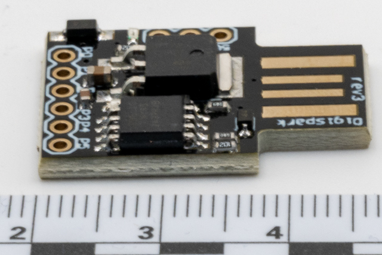
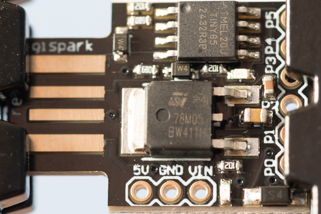

# Investigation summary




## Introduction

I purchased these devices from [Az-delivery.uk](https://www.az-delivery.uk/products/digispark-board?variant=19526615171168)

### Pros and Cons

| Pros                       | Cons                                   |
| :------------------------- | :------------------------------------- |
| Cheep ~£4                  | Does not look like a normal USB device |
| Possible to change VID&PID |                                        |

#### Links

* [Datasheet](https://cdn.shopify.com/s/files/1/1509/1638/files/Digispark_Datenblatt_AZ-Delivery_Vertriebs_GmbH.pdf?v=1608191245)
* [Arduino Libraries](https://cdn.shopify.com/s/files/1/1509/1638/files/attiny-master.zip?14116490563232555201)
* [Blog Change USB VID & PID on Digispark](https://blog.spacehuhn.com/digispark-vid-pid)

#### There are 3D printable cases available

* [Thingverse - DigiSpark case](https://www.thingiverse.com/thing:3494815)
* [Thingverse - Digispark attiny85 BadUsb fake usb memory case](https://www.thingiverse.com/thing:2347216)
* [Thingverse - Digispark Case](https://www.thingiverse.com/thing:5379775)
* [Thingverse - DigiSpark BadUSB](https://www.thingiverse.com/thing:3700609)
* [Thingverse - DigiSpark USB-Stick](https://www.thingiverse.com/thing:2492062)

### Uses

* Keystroke Injection Attack (BadUSB)

## Issues

## Detailed investigation

### Creating an attack

To install the DigiSpark into the Arduino IDE (2.3.6) using [Ircama's gist](https://gist.github.com/Ircama/22707e938e9c8f169d9fe187797a2a2c) and [Digistump](https://github.com/ArminJo/DigistumpArduino#installation):

1. Open the IDE
2. Goto File > Preferences
3. Add `https://raw.githubusercontent.com/ArminJo/DigistumpArduino/master/package_digistump_index.json` to the Additional boards manager URLs
4. Press OK
5. Goto Boards Manager
6. Search for Digispark
7. Intall `Digistump AVR Boards by Digistump` at version 1.7.5
8. Select the `Digispark (Default - 16.5mhz)` board profile
9. Select the programmer to be `microneucleus.2.5`
10. Go to Sketch > add library > DigisparkKeyboard

I had to rewite the standard attack to work with the [Digispark Keyboard](https://rootsaid.com/digispark-hid-digikeyboard-commands/)

```C
#include <DigiKeyboard.h>
#include <oddebug.h>
#include <osccal.h>
#include <osctune.h>
#include <scancode-ascii-table.h>
#include <usbconfig-prototype.h>
#include <usbconfig.h>
#include <usbdrv.h>
#include <usbportability.h>

/* Init function */
void setup()
{
  DigiKeyboard.delay(3000);
  DigiKeyboard.println("Hello, World!");
  DigiKeyboard.sendKeyStroke(KEY_ENTER); 
}

/* Unused endless loop */
void loop() {}
```

and programmed the device.

### Operation

The device was connected to the PC

### Setup

### Registry information

Detection under windows:

#### Device 1

##### Registry Entries for Device 1

| VendorId | ProductId | Interface | Description         | Notes                      | Keys                                                                     |
| -------- | --------- | --------- | ------------------- | -------------------------- | ------------------------------------------------------------------------ |
| 0x16C0   | 0x27DB    |           | USB Input Device    | ParentIdPrefix: 6&90b283&0 | HKLM\System\CurrentControlSet\Enum\USB\VID_16C0&PID_27DB\5&1d69338f&0&4  |
| 0x16C0   | 0x27DB    |           | HID Keyboard Device |                            | HKLM\System\CurrentControlSet\Enum\HID\VID_16C0&PID_27DB\6&90b283&0&0000 |
| 0x16D0   | 0x0753    |           |                     |                            | HKLM\System\CurrentControlSet\Enum\USB\VID_16D0&PID_0753\5&1d69338f&0&4  |

#### Device 2

##### Registry Entries for Device 2

| VendorId | ProductId | Interface | Description         | Notes                      | Keys                                                                     |
| -------- | --------- | --------- | ------------------- | -------------------------- | ------------------------------------------------------------------------ |
| 0x16C0   | 0x27DB    |           | USB Input Device    | ParentIdPrefix: 6&90b283&0 | HKLM\System\CurrentControlSet\Enum\USB\VID_16C0&PID_27DB\5&1d69338f&0&4  |
| 0x16C0   | 0x27DB    |           | HID Keyboard Device |                            | HKLM\System\CurrentControlSet\Enum\HID\VID_16C0&PID_27DB\6&90b283&0&0000 |
| 0x16D0   | 0x0753    |           |                     |                            | HKLM\System\CurrentControlSet\Enum\USB\VID_16D0&PID_0753\5&1d69338f&0&4  |

#### Device 3

##### Registry Entries for Device 3

| VendorId | ProductId | Interface | Description         | Notes                      | Keys                                                                     |
| -------- | --------- | --------- | ------------------- | -------------------------- | ------------------------------------------------------------------------ |
| 0x16C0   | 0x27DB    |           | USB Input Device    | ParentIdPrefix: 6&90b283&0 | HKLM\System\CurrentControlSet\Enum\USB\VID_16C0&PID_27DB\5&1d69338f&0&4  |
| 0x16C0   | 0x27DB    |           | HID Keyboard Device |                            | HKLM\System\CurrentControlSet\Enum\HID\VID_16C0&PID_27DB\6&90b283&0&0000 |
| 0x16D0   | 0x0753    |           |                     |                            | HKLM\System\CurrentControlSet\Enum\USB\VID_16D0&PID_0753\5&1d69338f&0&4  |

#### Device 4

##### Registry Entries for Device 4

| VendorId | ProductId | Interface | Description         | Notes                      | Keys                                                                     |
| -------- | --------- | --------- | ------------------- | -------------------------- | ------------------------------------------------------------------------ |
| 0x16C0   | 0x27DB    |           | USB Input Device    | ParentIdPrefix: 6&90b283&0 | HKLM\System\CurrentControlSet\Enum\USB\VID_16C0&PID_27DB\5&1d69338f&0&4  |
| 0x16C0   | 0x27DB    |           | HID Keyboard Device |                            | HKLM\System\CurrentControlSet\Enum\HID\VID_16C0&PID_27DB\6&90b283&0&0000 |
| 0x16D0   | 0x0753    |           |                     |                            | HKLM\System\CurrentControlSet\Enum\USB\VID_16D0&PID_0753\5&1d69338f&0&4  |

#### Device 5

##### Registry Entries for Device 5

| VendorId | ProductId | Interface | Description         | Notes                      | Keys                                                                     |
| -------- | --------- | --------- | ------------------- | -------------------------- | ------------------------------------------------------------------------ |
| 0x16C0   | 0x27DB    |           | USB Input Device    | ParentIdPrefix: 6&90b283&0 | HKLM\System\CurrentControlSet\Enum\USB\VID_16C0&PID_27DB\5&1d69338f&0&4  |
| 0x16C0   | 0x27DB    |           | HID Keyboard Device |                            | HKLM\System\CurrentControlSet\Enum\HID\VID_16C0&PID_27DB\6&90b283&0&0000 |
| 0x16D0   | 0x0753    |           |                     |                            | HKLM\System\CurrentControlSet\Enum\USB\VID_16D0&PID_0753\5&1d69338f&0&4  |

## Device Findings

The device following device:

| Vendor id | Product Id | Information                                       |
| --------- | ---------- | ------------------------------------------------- |
| 0x16D0    | 0x0753     | Digistump DigiSpark (Pid sold by MCS Electronics) |
| 0x16C0    | 0x27DB     | Van Ooijen Technische Informatica Keyboard        |

The findings for this device match the [zSecurity BadUsbCable](../BadUsbCable/Summary.md), which probably uses the same chip.

These devices are not traceable across a network as they have windows generated ids. They also seem to have issues detecting devices being changed out.
