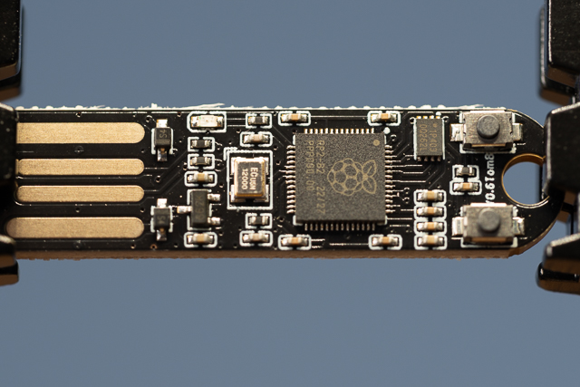

# Investigation summary


## Introduction

Purchased from [Elecrow.com](https://www.elecrow.com/picousb-raspberry-pi-pico-rp2040-powered-bad-usb-rubber-ducky.html)

This is a low cost circuit board Bad USB device, built around Raspberry Pi PR2040(pico). [Github](https://github.com/TomBrlek/PicoUSB) contains details on how to use the device, and links to other useful resources.

This device is technically running python, which is an interpreter for the simple language used to create an attack.

### Pros and Cons

| Pros                                                                  | Cons                     |
| :-------------------------------------------------------------------- | :----------------------- |
| Cheap (~£10)                                                          | Not a normal looking USB |
| Easy to setup (walkthrough and [video](https://youtu.be/jKH6WgFiaB0)) | No Case                  |
| Simple language to write attack                                       |                          |
| Can interact with mouse and volume as well as keyboard                |                          |
| Programmed via USB                                                    |                          |

#### There are 3D printable cases available

* [Thingverse - PicoUsb case](https://www.thingiverse.com/thing:7022646)

### Uses

* Keystroke Injection Attack (BadUSB)
* Mouse Jiggler
* Mouse injection attack

## Issues

You brick the device during setup.

## Detailed investigation

### Creating an attack

1. Download the latest [CircuitPython](https://circuitpython.org/board/raspberry_pi_pico/) for Rasperry Pi Pico.
2. Insert PicoUSB into your USB drive while holding the "Boot" button. (Opens it in a bootloader mode. The first time you do this you don't have to hold the "Boot" button)
3. Copy `CircuitPython.uf2` file to the USB and wait for it to finish setting up. (will close and reopen the explorer, be patient)
4. Create the payload, following the [example](https://github.com/TomBrlek/PicoUSB/blob/main/src/example.txt).

    ```txt
        delay(4)
        write(Hello, World!)
        press(enter)
    ```

5. Copy the src folder of the [repo](https://github.com/TomBrlek/PicoUSB/tree/main/src) to the USB device.
6. Save the script as `pico_usb.txt` on the USB device via explorer.

### Operation

* Inserting the PicoUSB while not holding any buttons will not show as a USB drive and will execute the "bad usb" code found in the pico_usb.txt.
* Inserting it while holding the "Mode" button will not execute any "bad usb" code and will show as a USB drive. This way you can freely edit the code.
* If you insert it while holding the "Boot" button, it will open in bootloader mode. This is used the first time, when configuring the device.

### Setup

### Registry information

Detection under windows:

This is a Raspbery pi Pico under the hood so we expect (Values taken from [the sz development](https://the-sz.com/products/usbid/index.php?v=0x2E8A)):

| Vendor id | Product Id |
| --------- | ---------- |
| 0x2E8A    | 0x003      |

#### Device 1


##### Registry Entries for Device 1

| VendorId | ProductId | Interface | Description                           | Notes                        | Keys                                                                                  |
| -------- | --------- | --------- | ------------------------------------- | ---------------------------- | ------------------------------------------------------------------------------------- |
| 0x239A   | 0x80F4    |           | USB Composite Device                  | ParentIdPrefix: 6&169dd6e5&0 | HKLM\System\CurrentControlSet\Enum\USB\VID_239A&PID_80F4\E66368254F853226             |
| 0x239A   | 0x80F4    | 0x00      | USB Serial Device                     |                              | HKLM\System\CurrentControlSet\Enum\USB\VID_239A&PID_80F4&MI_00\6&169dd6e5&0&0000      |
| 0x239A   | 0x80F4    | 0x02      | USB Input Device                      | ParentIdPrefix: 7&198ade8&0  | HKLM\System\CurrentControlSet\Enum\USB\VID_239A&PID_80F4&MI_02\6&169dd6e5&0&0002      |
| 0x239A   | 0x80F4    | 0x02      | HID Keyboard Device                   |                              | HKLM\System\CurrentControlSet\Enum\HID\VID_239A&PID_80F4&MI_02&Col01\7&198ade8&0&0000 |
| 0x239A   | 0x80F4    | 0x02      | HID-compliant mouse                   |                              | HKLM\System\CurrentControlSet\Enum\HID\VID_239A&PID_80F4&MI_02&Col02\7&198ade8&0&0001 |
| 0x239A   | 0x80F4    | 0x02      | HID-compliant consumer control device |                              | HKLM\System\CurrentControlSet\Enum\HID\VID_239A&PID_80F4&MI_02&Col03\7&198ade8&0&0002 |
| 0x239A   | 0x80F4    | 0x03      | USB Audio Device                      |                              | HKLM\System\CurrentControlSet\Enum\USB\VID_239A&PID_80F4&MI_03\6&169dd6e5&0&0003      |

#### Device 2


Machine restarted before insertion

##### Bootloader

| VendorId | ProductId | Interface | Description             | Notes                        | Keys                                                                                                                                                         |
| -------- | --------- | --------- | ----------------------- | ---------------------------- | ------------------------------------------------------------------------------------------------------------------------------------------------------------ |
| RPI      | RP2       |           | Disk drive              |                              | HKLM\System\CurrentControlSet\Enum\USBSTOR\Disk&Ven_RPI&Prod_RP2&Rev_3\7&1abfde23&0&E0C9125B0D9B&0                                                           |
| RPI      | RP2       |           | Volume                  |                              | HKLM\System\CurrentControlSet\Enum\STORAGE\Volume\_??_USBSTOR#Disk&Ven_RPI&Prod_RP2&Rev_3#7&1abfde23&0&E0C9125B0D9B&0#{53f56307-b6bf-11d0-94f2-00a0c91efb8b} |
| RPI      | RP2       |           | DeviceDesc: RP2         |                              | HKLM\System\CurrentControlSet\Enum\SWD\WPDBUSENUM\_??_USBSTOR#Disk&Ven_RPI&Prod_RP2&Rev_3#7&1abfde23&0&E0C9125B0D9B&0#{53f56307-b6bf-11d0-94f2-00a0c91efb8b} |
| 0x2E8A   | 0x0003    |           | USB Composite Device    | ParentIdPrefix: 6&22cf742d&0 | HKLM\System\CurrentControlSet\Enum\USB\VID_2E8A&PID_0003\E0C9125B0D9B                                                                                        |
| 0x2E8A   | 0x0003    | 0x00      | USB Mass Storage Device | ParentIdPrefix: 7&1abfde23&0 | HKLM\System\CurrentControlSet\Enum\USB\VID_2E8A&PID_0003&MI_00\6&22cf742d&0&0000                                                                             |
| 0x2E8A   | 0x0003    | 0x01      | DeviceDesc: RP2 Boot    |                              | HKLM\System\CurrentControlSet\Enum\USB\VID_2E8A&PID_0003&MI_01\6&22cf742d&0&0001                                                                             |

##### Registry Entries for Device 2

| VendorId | ProductId | Interface | Description                           | Notes                        | Keys                                                                                   |
| -------- | --------- | --------- | ------------------------------------- | ---------------------------- | -------------------------------------------------------------------------------------- |
| 0x239A   | 0x80F4    |           | USB Composite Device                  | ParentIdPrefix: 6&18f19057&0 | HKLM\System\CurrentControlSet\Enum\USB\VID_239A&PID_80F4\E66368254F3E9F27              |
| 0x239A   | 0x80F4    | 0x00      | USB Serial Device                     |                              | HKLM\System\CurrentControlSet\Enum\USB\VID_239A&PID_80F4&MI_00\6&18f19057&0&0000       |
| 0x239A   | 0x80F4    | 0x02      | USB Input Device                      | ParentIdPrefix: 7&2fd3b672&0 | HKLM\System\CurrentControlSet\Enum\USB\VID_239A&PID_80F4&MI_02\6&18f19057&0&0002       |
| 0x239A   | 0x80F4    | 0x02      | HID Keyboard Device                   |                              | HKLM\System\CurrentControlSet\Enum\HID\VID_239A&PID_80F4&MI_02&Col01\7&2fd3b672&0&0000 |
| 0x239A   | 0x80F4    | 0x02      | HID-compliant mouse                   |                              | HKLM\System\CurrentControlSet\Enum\HID\VID_239A&PID_80F4&MI_02&Col02\7&2fd3b672&0&0001 |
| 0x239A   | 0x80F4    | 0x02      | HID-compliant consumer control device |                              | HKLM\System\CurrentControlSet\Enum\HID\VID_239A&PID_80F4&MI_02&Col03\7&2fd3b672&0&0002 |
| 0x239A   | 0x80F4    | 0x03      | USB Audio Device                      |                              | HKLM\System\CurrentControlSet\Enum\USB\VID_239A&PID_80F4&MI_03\6&18f19057&0&0003       |

#### Device 3


##### Registry Entries for Device 3

| VendorId | ProductId | Interface | Description                           | Notes                        | Keys                                                                                   |
| -------- | --------- | --------- | ------------------------------------- | ---------------------------- | -------------------------------------------------------------------------------------- |
| 0x239A   | 0x80F4    |           | USB Composite Device                  | ParentIdPrefix: 6&285546c3&0 | HKLM\System\CurrentControlSet\Enum\USB\VID_239A&PID_80F4\E66368254F828728              |
| 0x239A   | 0x80F4    | 0x00      | USB Serial Device                     |                              | HKLM\System\CurrentControlSet\Enum\USB\VID_239A&PID_80F4&MI_00\6&285546c3&0&0000       |
| 0x239A   | 0x80F4    | 0x02      | USB Input Device                      | ParentIdPrefix: 7&1b11a913&0 | HKLM\System\CurrentControlSet\Enum\USB\VID_239A&PID_80F4&MI_02\6&285546c3&0&0002       |
| 0x239A   | 0x80F4    | 0x02      | HID Keyboard Device                   |                              | HKLM\System\CurrentControlSet\Enum\HID\VID_239A&PID_80F4&MI_02&Col01\7&1b11a913&0&0000 |
| 0x239A   | 0x80F4    | 0x02      | HID-compliant mouse                   |                              | HKLM\System\CurrentControlSet\Enum\HID\VID_239A&PID_80F4&MI_02&Col02\7&1b11a913&0&0001 |
| 0x239A   | 0x80F4    | 0x02      | HID-compliant consumer control device |                              | HKLM\System\CurrentControlSet\Enum\HID\VID_239A&PID_80F4&MI_02&Col03\7&1b11a913&0&0002 |
| 0x239A   | 0x80F4    | 0x03      | USB Audio Device                      |                              | HKLM\System\CurrentControlSet\Enum\USB\VID_239A&PID_80F4&MI_03\6&285546c3&0&0003       |

#### Device 4


##### Registry Entries for Device 4

| VendorId | ProductId | Interface | Description                           | Notes                        | Keys                                                                                   |
| -------- | --------- | --------- | ------------------------------------- | ---------------------------- | -------------------------------------------------------------------------------------- |
| 0x239A   | 0x80F4    |           | USB Composite Device                  | ParentIdPrefix: 6&831d513&0  | HKLM\System\CurrentControlSet\Enum\USB\VID_239A&PID_80F4\E66368254F554721              |
| 0x239A   | 0x80F4    | 0x00      | USB Serial Device                     |                              | HKLM\System\CurrentControlSet\Enum\USB\VID_239A&PID_80F4&MI_00\6&831d513&0&0000        |
| 0x239A   | 0x80F4    | 0x02      | USB Input Device                      | ParentIdPrefix: 7&23f92e38&0 | HKLM\System\CurrentControlSet\Enum\USB\VID_239A&PID_80F4&MI_02\6&831d513&0&0002        |
| 0x239A   | 0x80F4    | 0x02      | HID Keyboard Device                   |                              | HKLM\System\CurrentControlSet\Enum\HID\VID_239A&PID_80F4&MI_02&Col01\7&23f92e38&0&0000 |
| 0x239A   | 0x80F4    | 0x02      | HID-compliant mouse                   |                              | HKLM\System\CurrentControlSet\Enum\HID\VID_239A&PID_80F4&MI_02&Col02\7&23f92e38&0&0001 |
| 0x239A   | 0x80F4    | 0x02      | HID-compliant consumer control device |                              | HKLM\System\CurrentControlSet\Enum\HID\VID_239A&PID_80F4&MI_02&Col03\7&23f92e38&0&0002 |
| 0x239A   | 0x80F4    | 0x03      | USB Audio Device                      |                              | HKLM\System\CurrentControlSet\Enum\USB\VID_239A&PID_80F4&MI_03\6&831d513&0&0003        |

#### Device 5



##### Registry Entries for Device 5

| VendorId | ProductId | Interface | Description                           | Notes                        | Keys                                                                                   |
| -------- | --------- | --------- | ------------------------------------- | ---------------------------- | -------------------------------------------------------------------------------------- |
| 0x239A   | 0x80F4    |           | USB Composite Device                  | ParentIdPrefix: 6&2d726e30&0 | HKLM\System\CurrentControlSet\Enum\USB\VID_239A&PID_80F4\E66368254F0F8921              |
| 0x239A   | 0x80F4    | 0x00      | USB Serial Device                     |                              | HKLM\System\CurrentControlSet\Enum\USB\VID_239A&PID_80F4&MI_00\6&2d726e30&0&0000       |
| 0x239A   | 0x80F4    | 0x02      | USB Input Device                      | ParentIdPrefix: 7&1db61454&0 | HKLM\System\CurrentControlSet\Enum\USB\VID_239A&PID_80F4&MI_02\6&2d726e30&0&0002       |
| 0x239A   | 0x80F4    | 0x02      | HID Keyboard Device                   |                              | HKLM\System\CurrentControlSet\Enum\HID\VID_239A&PID_80F4&MI_02&Col01\7&1db61454&0&0000 |
| 0x239A   | 0x80F4    | 0x02      | HID-compliant mouse                   |                              | HKLM\System\CurrentControlSet\Enum\HID\VID_239A&PID_80F4&MI_02&Col02\7&1db61454&0&0001 |
| 0x239A   | 0x80F4    | 0x02      | HID-compliant consumer control device |                              | HKLM\System\CurrentControlSet\Enum\HID\VID_239A&PID_80F4&MI_02&Col03\7&1db61454&0&0002 |
| 0x239A   | 0x80F4    | 0x03      | USB Audio Device                      |                              | HKLM\System\CurrentControlSet\Enum\USB\VID_239A&PID_80F4&MI_03\6&2d726e30&0&0003       |

#### Notes

The device instance ids come from the device. This allows tracing between computers.

| Device   | Device Serial Number |
| -------- | -------------------- |
| Device 1 | E66368254F853226     |
| Device 2 | E66368254F3E9F27     |
| Device 3 | E66368254F828728     |
| Device 4 | E66368254F554721     |
| Device 5 | E66368254F0F8921     |
