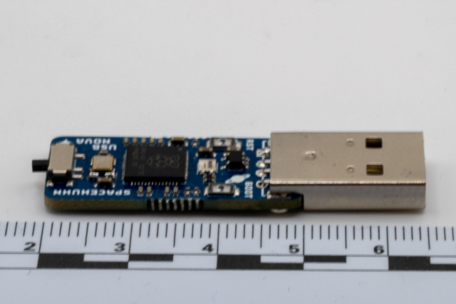
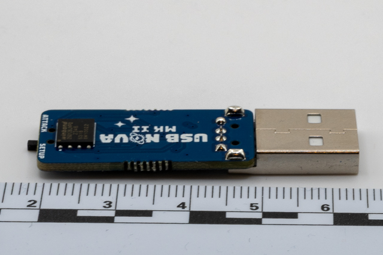
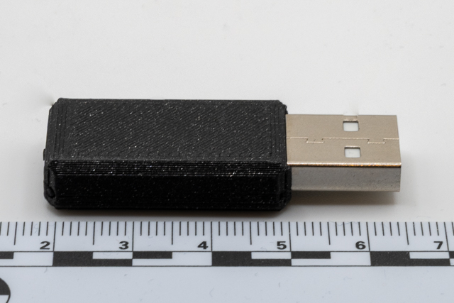
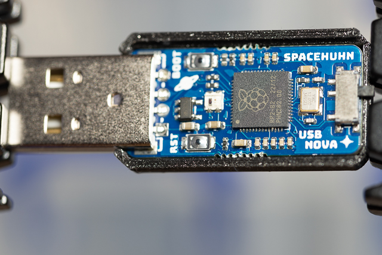
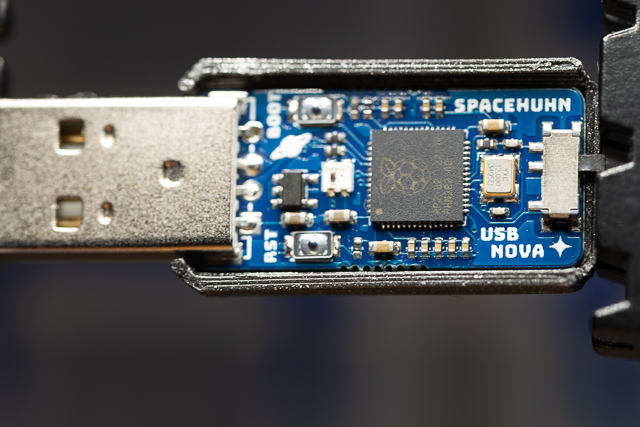

# Investigation summary





## Introduction

I purchased these devices from [SpaceHunn](https://spacehuhn.store/products/usb-nova-mkii)

### Pros and Cons

| Pros        | Cons                            |
| :---------- | :------------------------------ |
| Easy to use | Not cheep ~£30                  |
|             | Needs a case to look like a usb |

#### There are 3D printable cases available

* [Space Hunn Case](https://spacehuhn.store/products/case-for-usb-nova-mkii-usb-a)

### Uses

* Keystroke Injection Attack (BadUSB)

## Issues

## Detailed investigation

### Creating an attack

Create a simple script based on [USB Nova's script language](https://usbnova.com/docs/scripting/basics)

```Script
DELAY 3000
STRING Hello,World!
ENTER
```

and programmed the device according to [instructions](https://usbnova.com/docs/usage/basics)

1. Set device to setup mode
2. Insert device
3. Update `main_script.txt`
4. Remove device
5. Switch to Attack Mode

### Operation

1. Check device is in attack mode
2. Insert into USB port

### Setup

### Registry information

Detection under windows:

#### Device 1



##### Registry Entries for Device 1

| VendorId | ProductId | Interface | Description                           | Notes                        | Keys                                                                             |
| -------- | --------- | --------- | ------------------------------------- | ---------------------------- | -------------------------------------------------------------------------------- |
| 0x16D0   | 0x11A4    |           | USB Input Device                      | ParentIdPrefix: 6&36495c8e&0 | HKLM\System\CurrentControlSet\Enum\USB\VID_16D0&PID_11A4\1337                    |
| 0x16D0   | 0x11A4    |           | HID-compliant consumer control device |                              | HKLM\System\CurrentControlSet\Enum\HID\VID_16D0&PID_11A4&Col03\6&36495c8e&0&0002 |
| 0x16D0   | 0x11A4    |           | HID-compliant mouse                   |                              | HKLM\System\CurrentControlSet\Enum\HID\VID_16D0&PID_11A4&Col02\6&36495c8e&0&0001 |
| 0x16D0   | 0x11A4    |           | HID Keyboard Device                   |                              | HKLM\System\CurrentControlSet\Enum\HID\VID_16D0&PID_11A4&Col01\6&36495c8e&0&0000 |

#### Device 2



##### Registry Entries for Device 2

| VendorId | ProductId | Interface | Description                           | Notes                        | Keys                                                                             |
| -------- | --------- | --------- | ------------------------------------- | ---------------------------- | -------------------------------------------------------------------------------- |
| 0x16D0   | 0x11A4    |           | USB Input Device                      | ParentIdPrefix: 6&36495c8e&0 | HKLM\System\CurrentControlSet\Enum\USB\VID_16D0&PID_11A4\1337                    |
| 0x16D0   | 0x11A4    |           | HID-compliant consumer control device |                              | HKLM\System\CurrentControlSet\Enum\HID\VID_16D0&PID_11A4&Col03\6&36495c8e&0&0002 |
| 0x16D0   | 0x11A4    |           | HID-compliant mouse                   |                              | HKLM\System\CurrentControlSet\Enum\HID\VID_16D0&PID_11A4&Col02\6&36495c8e&0&0001 |
| 0x16D0   | 0x11A4    |           | HID Keyboard Device                   |                              | HKLM\System\CurrentControlSet\Enum\HID\VID_16D0&PID_11A4&Col01\6&36495c8e&0&0000 |

#### Notes

Both these devices appear as a no longer valid VID which used to belong to `MCS Electronics`, MCS Electronics sold individual PIDs before USB-IF changed the rules about this, and revoked their VendorId

Bocth devices use the same device instance id `1337` which makes tracking indivual devices very difficult.
